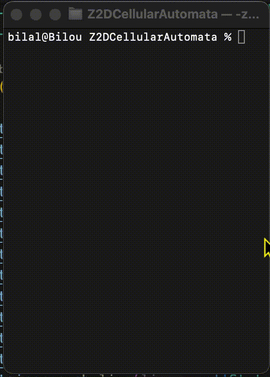

### Z1DCellularAutomata
Simple representation of a cellular automaton following the rules established by the game of life of Conway.

### Explanation
Cellular automata can be in 3 states: `Border, Dead, Alive`. The Border state is only there to avoid overflows caused by :
```rust
let neighbors: Vec<(Neighbors, GOLCellularAutomata)> = vec![
    (Neighbors::TopRight, self.game[i - 1][j + 1]),
    (Neighbors::TopUp, self.game[i - 1][j]),
    (Neighbors::TopLeft, self.game[i - 1][j - 1]),
    (Neighbors::LEFT, self.game[i][j - 1]),
    (Neighbors::RIGHT, self.game[i][j + 1]),
    (Neighbors::BottomLeft, self.game[i + 1][j - 1]),
    (Neighbors::BottomDown, self.game[i + 1][j]),
    (Neighbors::BottomRight, self.game[i + 1][j + 1]),
];
```

Automata are governed by the [rules](https://fr.wikipedia.org/wiki/Jeu_de_la_vie#Règles) of the game of life.
```rust
fn get_info(of: Vec<(Neighbors, GOLCellularAutomata)>) -> (usize, usize);
```

There are two solutions: use `push_line(line:Vec<State>, is_last: bool) -> ();` or write all the states (including the `Border state`) tediously.

1st option
```rust
container.push_line(vec![State::DEAD, State::DEAD, State::ALIVE, State::DEAD, State::ALIVE, State::DEAD, State::ALIVE, State::DEAD, State::ALIVE, State::DEAD, State::DEAD, State::DEAD], false);
container.push_line(vec![State::DEAD, State::DEAD, State::ALIVE, State::DEAD, State::ALIVE, State::DEAD, State::DEAD, State::DEAD, State::ALIVE, State::DEAD, State::DEAD, State::DEAD], false);

container.push_line(vec![State::DEAD, State::DEAD, State::ALIVE, State::DEAD, State::ALIVE, State::DEAD, State::DEAD, State::ALIVE, State::ALIVE, State::DEAD, State::DEAD, State::DEAD], false);

container.push_line(vec![State::DEAD, State::DEAD, State::ALIVE, State::DEAD, State::DEAD, State::DEAD, State::DEAD, State::DEAD, State::ALIVE, State::DEAD, State::DEAD, State::DEAD], false);
container.push_line(vec![State::DEAD, State::DEAD, State::DEAD, State::DEAD, State::ALIVE, State::DEAD, State::DEAD, State::DEAD, State::DEAD, State::DEAD, State::DEAD, State::DEAD], false);
container.push_line(vec![State::DEAD, State::DEAD, State::ALIVE, State::DEAD, State::ALIVE, State::ALIVE, State::ALIVE, State::DEAD, State::ALIVE, State::DEAD, State::DEAD, State::DEAD], true);
```
Set representation (and 2nd option to inject in `GOLContainer::new(list);`)
```rust
let list: Vec<Vec<State>> = vec![
    vec![State::Border, State::Border, State::Border, State::Border, State::Border, State::Border, State::Border, State::Border, State::Border, State::Border, State::Border, State::Border,],
    vec![State::Border,State::DEAD, State::DEAD, State::ALIVE, State::DEAD, State::ALIVE, State::DEAD, State::ALIVE,State::DEAD, State::ALIVE, State::DEAD, State::DEAD, State::DEAD,State::Border,],
    vec![State::Border,State::DEAD, State::DEAD, State::ALIVE, State::DEAD, State::ALIVE, State::DEAD, State::DEAD, State::DEAD, State::ALIVE, State::DEAD, State::DEAD, State::DEAD,State::Border,],
    vec![State::Border,State::DEAD, State::DEAD, State::ALIVE, State::DEAD, State::ALIVE, State::DEAD, State::DEAD, State::ALIVE, State::ALIVE, State::DEAD, State::DEAD, State::DEAD,State::Border,],
    vec![State::Border,State::DEAD, State::DEAD, State::ALIVE, State::DEAD, State::DEAD, State::DEAD, State::DEAD, State::DEAD, State::ALIVE, State::DEAD, State::DEAD, State::DEAD,State::Border,],
    vec![State::Border,State::DEAD, State::DEAD, State::DEAD, State::DEAD, State::ALIVE, State::DEAD, State::DEAD, State::DEAD, State::DEAD, State::DEAD, State::DEAD, State::DEAD,State::Border,],
    vec![State::Border,State::DEAD, State::DEAD, State::ALIVE, State::DEAD, State::ALIVE, State::ALIVE, State::ALIVE, State::DEAD, State::ALIVE, State::DEAD, State::DEAD, State::DEAD,State::Border,],
    vec![State::Border, State::Border, State::Border, State::Border, State::Border, State::Border, State::Border, State::Border, State::Border, State::Border, State::Border, State::Border,],
]
```

### Simulation
Simulation is performed using `GOLContainer::run(self: &mut Self, step: usize, speed_milis: u64) -> ()`. To run a simulation of 20 steps with a refresh interval of 10ms, I write :
`container.run(20, 10);`. If you want infinite steps, just set `step` to 0.



### References
- [Concept](https://fr.wikipedia.org/wiki/Jeu_de_la_vie)

### Licence
This project is licensed under the MIT License - see the LICENSE file for details.

### Contact
If you have any questions or encounter any issues, please open an issue on the GitHub repository at https://github.com/lalBi94/Z2DCellularAutomata/issues or send an email to bilal.boudjemline@etu.u-pec.fr.